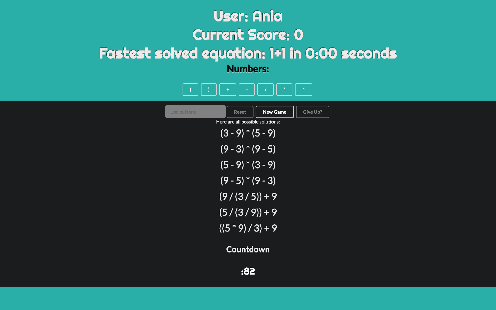
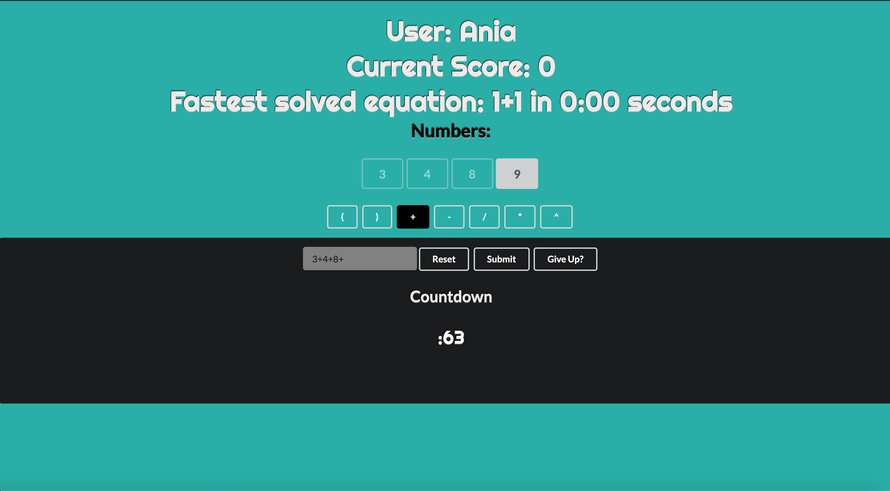

# 24 Game

Welcome to the 24 Game, where you are given the chance to try your math skills by making a set of 4 numbers equal 24 through addition, subtraction, multiplication, dividson, and exponentiation. 

Available features:

- **Users can submit a Username to keep track of game session**
- **Users can pick the difficulty (based on number of seconds allowed to solve the problems)**
- **Users can click on given buttons (4 number buttons, and 6 artimatic buttons) and see their current response in an user input field**
- **Users can give-up on solving the current equation, and a solution will be rendered from an API with the given numbers**
- **Users can attempt to solve the math equation (which will then be evaluted using Math.js) or reset their current attempt to try again (as long as their is enough time remaining)**

## Installation

- Fork and clone this repo and [the backend repo](https://github.com/adybas/JS-24-Game-Backend)

- first cd into the js-24-game-backend directory in the backend repo
  - Run `$ rails db:create`
  - Run `$ rails db:migrate`
  - Run `$ rails server`
  
- After the backend is up, cd into the js-24-game-frontend directory
  - Run `$ bundle install`
  - Run `$ open index.html`

## Frameworks and Libraries Used

- Front-end: JavaScript and [Math.js](https://mathjs.org/)
- Back-end: [Ruby on Rails](https://github.com/rails/rails)
- [Semantic-UI](https://semantic-ui.com/)

## Author

- Anna Dybas (https://github.com/adybas)
- Sean Beach (https://github.com/seanb113)

## Contributing

Bug reports and pull requests are welcome on GitHub at https://github.com/adybas/JS-24-Game-Frontend/issues. This project is intended to be a safe, welcoming space for collaboration, and contributors are expected to adhere to the [Contributor Covenant](http://contributor-covenant.org) code of conduct.

## License

The code is available as open source under the terms of the [MIT License](https://opensource.org/licenses/MIT).

## Screenshots of Game

 

 

 

 

 